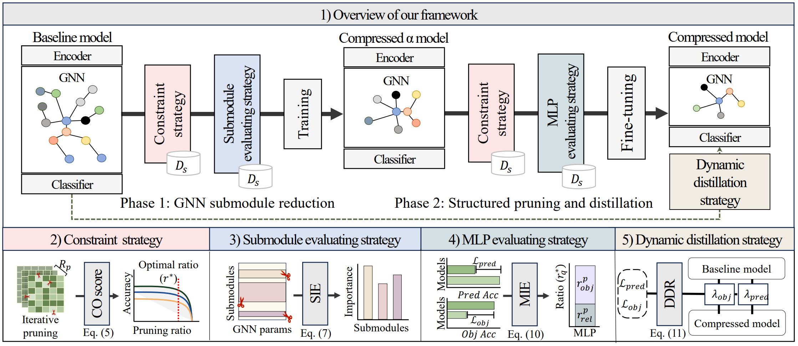

# Compression Framework for Light 3D Scene Graph Generation via Pruning-as-Search and Distillation

#### IEEE Transactions on Multimedia (Early Access), 2026  [📄 Paper](https://ieeexplore.ieee.org/document/11329462) · [📑 BibTeX](assets/3DSGG-compression_bib.bib)

<a href="https://scholar.google.co.kr/citations?user=Lq8vO8EAAAAJ&hl=ko">Hojun Song*</a>,
<a href="https://scholar.google.co.kr/citations?user=m-NwAdUAAAAJ&hl=ko&oi=sra">Chae-yeong Song*</a>,
<a href="https://scholar.google.co.kr/citations?user=nGogINkAAAAJ&hl=ko&oi=sra">Dong-hun Lee</a>,
<a href="https://scholar.google.com/citations?view_op=list_works&hl=ko&user=zocGdPwAAAAJ">Heejung Choi</a>,
<a href="https://scholar.google.co.kr/citations?user=-DlLMawAAAAJ&hl=ko&oi=sra">Jinwoo Jeong</a>,
Sungjei Kim,
and <a href="https://scholar.google.com/citations?user=ZG8REuYAAAAJ&hl=en">Sang-hyo Park</a><sup>†</sup>

\* Equal contribution  
<sup>†</sup> Corresponding author

<p align="center">
  
</p>

A lightweight compression framework for **GNN-based 3D scene graph generation** that integrates **pruning-as-search** and **knowledge distillation** to substantially reduce computational complexity while preserving classification performance.


## TODO
- [ ] Code Release

## Citation

If you find this work useful, please cite:

```
@ARTICLE{11329462,
  author={Song, Hojun and Song, Chae-yeong and Lee, Dong-hun and Choi, Heejung and Jeong, Jinwoo and Kim, Sungjei and Park, Sang-hyo},
  journal={IEEE Transactions on Multimedia}, 
  title={Compression Framework for Light 3D Scene Graph Generation via Pruning-As-Search and Distillation}, 
  year={2026},
  volume={},
  number={},
  pages={1-13},
  keywords={Three-dimensional displays;Computational modeling;Accuracy;Point cloud compression;Semantics;Model compression;Electronic mail;Adaptation models;Knowledge transfer;Image coding;3D scene graph generation;graph neural networks;model compression;pruning;knowledge distillation},
  doi={10.1109/TMM.2026.3651094}}
```


